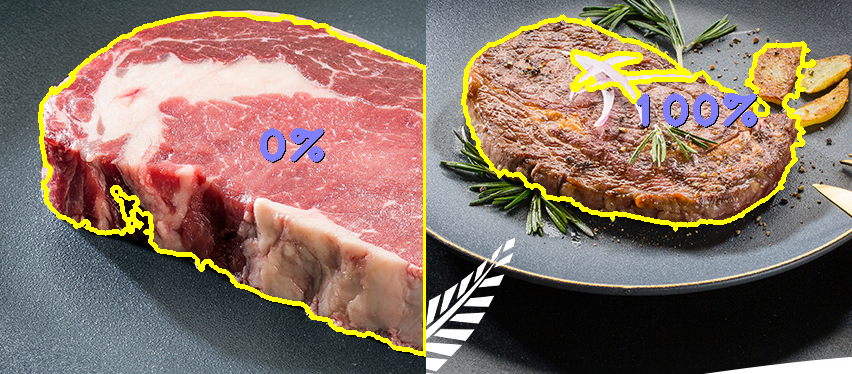

# 烤肉识别器！

事情是这样的——

世界上大概有8%的人是色盲，对于他们来说，烤肉是一项很难的工作。因为他们分不清肉的颜色，所以不知道肉到底熟了没有。

这意味着，每年都会有很多色盲，吃了没有熟的烤肉而被毒死！

为了防止我也被毒死，所以先来做一个烤肉识别器，用来识别肉到底熟了没有，这样下次吃的时候食品安全就有保证了！

## 效果

效果真是太好了！

(其实还有成千上万的bad case没有贴出来)

## 使用方法

1. 安装Python3.6以上版本

2. `pip install -r requirements.txt`

3. 插入一个摄像头

4. `python cinder.py`

## 赞助

如果你在吃了烤肉之后没有被毒死，请给作者介绍一些可爱的萝莉朋友。

最好是那种会坐在腿上蹭蹭，喊「欧尼酱」的。
